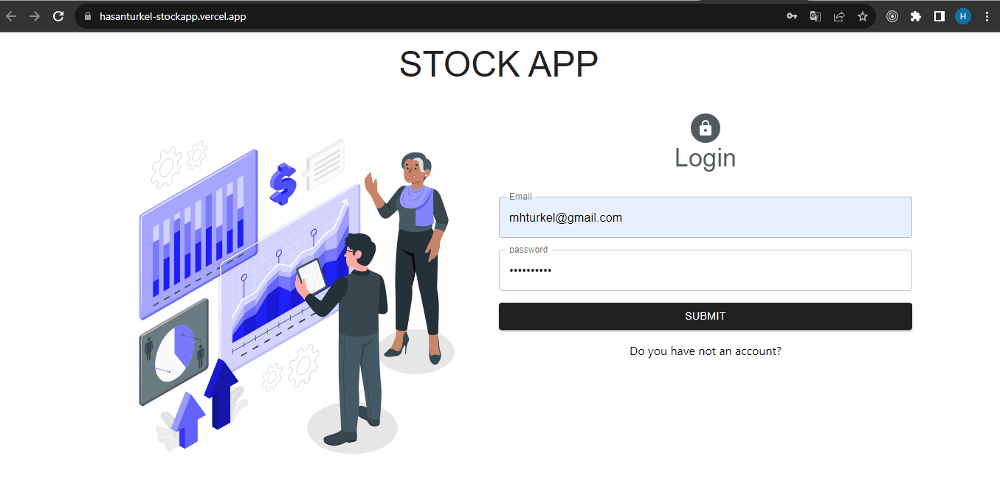

# stock-app

Stock app is a product managament system that you can make crud process. And this repo is the frontend side of the project. To see the backend repo you can visit [stockapp-fs-backend repo.](https://github.com/Hasan-Turkel/stockapi-fs-backend)
## [Click to see live link](https://stockapi-fs-frontend.vercel.app/)

NOTE: For one who registers can view only. Crud processes are available just for admin.

## This is how the site looks like.

